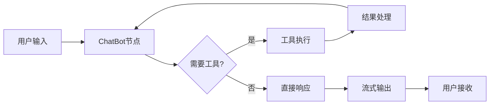

# LLM Chat With Tools - 智能对话工具集成模块

## 概述

`llm_chat_with_tools` 是 FastAPI AI 助手后端的核心模块，提供了集成多种外部工具的智能对话能力。该模块基于 LangGraph 构建，支持工具链编排、状态管理和实时流式响应。

## 📁 目录结构

```
llm_chat_with_tools/
├── __init__.py                  # 包初始化文件
├── chatbot/
│   ├── __init__.py
│   └── ChatBot.py              # 核心聊天机器人实现
└── tools/
    ├── __init__.py
    ├── calculate_tools.py       # 数学计算工具
    ├── result_processor.py      # 结果处理器
    └── search_tools.py         # 搜索和网页爬取工具
```

## 🤖 核心组件

### ChatBot 类 (`chatbot/ChatBot.py`)

智能对话机器人的主要实现，集成了多种工具和状态管理功能。

#### 主要功能
- **多工具集成**: 支持搜索、计算、网页爬取、MCP 工具
- **流式响应**: Server-Sent Events (SSE) 实时流式输出
- **对话管理**: 完整的 CRUD 操作（创建、读取、编辑、删除）
- **智能命名**: 自动为对话生成有意义的标题
- **状态持久化**: PostgreSQL 数据库存储对话历史

#### 核心特性

**时间感知系统**
```python
def get_current_time_prompt() -> str:
    """获取包含当前时间信息的系统提示词"""
    # 自动获取中国时间（东八区）
    # 提供时间感知的智能回答
```

**工具编排架构**
- 基于 LangGraph 的状态图架构
- 支持工具条件执行和结果处理
- 可配置的结果处理流水线

**对话生命周期管理**
- 自动生成对话标题
- 支持消息编辑和删除
- 批量操作支持

### 工具模块 (`tools/`)

#### 1. 搜索工具 (`search_tools.py`)

提供智能网络搜索和网页内容抓取功能。

**主要工具:**

**`search_tool`** - 智能网络搜索引擎
```python
@tool
async def search_tool(query: str, config: RunnableConfig = None) -> str:
    """
    - 基于 Google 搜索引擎
    - 支持中文和英文查询
    - 返回最多 10 个高质量结果
    - 可选 LLM 智能总结功能
    """
```

**`web_crawler`** - 批量网页内容抓取
```python
@tool
async def web_crawler(links: List[str], config: RunnableConfig = None) -> str:
    """
    - 同时抓取多个网页内容
    - 智能清理无关内容
    - 结构化输出格式
    - 支持 LLM 智能总结
    """
```

**功能特点:**
- ✅ 实时搜索结果获取
- ✅ 智能内容提取和清理
- ✅ 结构化格式化输出
- ✅ 可选的 LLM 智能总结
- ✅ 来源标注和链接追踪

#### 2. 计算工具 (`calculate_tools.py`)

提供安全的数学计算和统计分析功能。

**主要工具:**

**`calculate_tools`** - 强化数学计算器
```python
@tool
async def calculate_tools(expression: str) -> str:
    """
    支持功能:
    - 基本运算: +, -, *, /, //, %, **
    - 数学函数: sqrt, exp, log, sin, cos, tan 等
    - 统计函数: mean, median, stdev, variance 等
    - 数学常量: pi, e, tau 等
    """
```

**`advanced_math`** - 高级数学运算
```python
@tool
async def advanced_math(operation: str, data: List[float], **kwargs) -> str:
    """
    支持操作:
    - descriptive: 描述性统计
    - distribution: 分布分析  
    - probability: 概率计算
    """
```

**安全特性:**
- ✅ AST 安全解析，防止代码注入
- ✅ 白名单函数和操作符
- ✅ 沙箱化计算环境
- ✅ 详细的错误处理和用户友好提示

#### 3. 结果处理器 (`result_processor.py`)

智能处理 MCP 工具输出，提供多种处理模式。

**处理模式:**
```python
class ProcessingMode(Enum):
    RAW = "raw"              # 原始输出
    SUMMARY = "summary"      # 智能摘要
    FORMATTED = "formatted"  # 格式化输出
    FILTERED = "filtered"    # 内容过滤
    STRUCTURED = "structured" # 结构化处理
```

**核心功能:**
- ✅ LLM 驱动的智能摘要生成
- ✅ 多种格式化输出选项
- ✅ 灵活的内容过滤机制
- ✅ JSON 和文本结构化处理

## 🔧 技术架构

### 状态管理架构



### 工具集成流程

1. **工具注册**: 动态加载本地工具和 MCP 工具
2. **条件执行**: LangGraph 自动判断是否需要调用工具
3. **并行处理**: 支持多工具并行执行
4. **结果后处理**: 可选的智能总结和格式化
5. **状态更新**: 自动更新对话状态并持久化

### 数据流架构

```
用户查询 → 意图识别 → 工具选择 → 工具执行 → 结果处理 → 响应生成 → 流式输出
```

## 🚀 快速开始

### 基本使用示例

```python
from llm.llm_chat_with_tools.chatbot.ChatBot import ChatBot

# 初始化聊天机器人
bot = ChatBot(
    model="Qwen/Qwen2.5-7B-Instruct",
    enable_result_processing=True
)

# 异步初始化
await bot.initialize()

# 开始对话
async for chunk in bot.generate(
    query="搜索今天杭州的天气",
    thread_id="user_123"
):
    print(chunk)
```

### 配置选项

```python
# 自定义模型配置
bot = ChatBot(
    model="deepseek-chat",           # 指定模型
    enable_result_processing=True     # 启用结果处理
)

# 带 LLM 总结的配置
config = RunnableConfig(
    configurable={
        "thread_id": "session_id",
        "summary_with_llm": True      # 启用 LLM 智能总结
    }
)
```

## 🛠️ API 参考

### ChatBot 类方法

| 方法 | 功能 | 参数 | 返回值 |
|------|------|------|--------|
| `initialize()` | 初始化机器人 | 无 | None |
| `generate()` | 生成对话响应 | query, thread_id, summary_with_llm | AsyncGenerator |
| `named_chat()` | 生成对话标题 | thread_id | str |
| `get_history()` | 获取历史记录 | thread_id | List[BaseMessage] |
| `delete_history()` | 删除历史记录 | thread_id | bool |
| `edit_message()` | 编辑消息 | thread_id, message_idx, new_content | bool |
| `delete_message()` | 删除消息 | thread_id, message_idx | bool |

### 工具函数

| 工具 | 功能 | 输入 | 输出 |
|------|------|------|------|
| `search_tool` | 网络搜索 | query: str | 格式化搜索结果 |
| `web_crawler` | 网页爬取 | links: List[str] | 网页内容摘要 |
| `calculate_tools` | 数学计算 | expression: str | 计算结果 |
| `advanced_math` | 高级数学 | operation: str, data: List[float] | 统计分析结果 |

## 📊 配置说明

### 环境依赖

```python
# 必需的配置项
app_config.database_url          # PostgreSQL 数据库连接
app_config.deepseek_api_key      # DeepSeek API 密钥
app_config.deepseek_api_base     # DeepSeek API 基础 URL
app_config.search_api_url        # 搜索 API 端点
app_config.search_api_key        # 搜索 API 密钥
app_config.crawl_api_url         # 爬虫 API 端点
app_config.mcp_server_url        # MCP 服务器 URL
```

### 数据库设置

系统使用 PostgreSQL 存储对话历史和状态：

```python
# 自动初始化数据库表结构
await memory.setup()
```

### 工具配置

```python
# 工具列表配置
tools = [
    search_tool,      # 搜索工具
    calculate_tools,  # 计算工具
    advanced_math,    # 高级数学
    web_crawler,      # 网页爬虫
    *mcp_tools       # MCP 工具（动态加载）
]
```

## 🔍 使用场景

### 1. 信息搜索和研究
- 实时新闻查询
- 学术资料搜索
- 产品信息对比
- 技术文档查找

### 2. 数据分析和计算
- 数学公式计算
- 统计数据分析
- 科学计算
- 财务计算

### 3. 内容整理和总结
- 网页内容提取
- 多源信息整合
- 智能摘要生成
- 结构化数据处理

### 4. 对话管理
- 长期对话历史
- 对话分支管理
- 消息编辑和删除
- 批量操作

## ⚡ 性能优化

### 异步架构
- 全异步 I/O 操作
- 并发工具执行
- 流式响应减少延迟

### 缓存策略
- 数据库连接池
- 工具结果缓存
- 状态快照机制

### 资源管理
- 自动连接管理
- 内存使用优化
- 错误恢复机制

## 🛡️ 安全特性

### 计算安全
- AST 安全解析
- 函数白名单机制
- 沙箱化执行环境

### 数据安全
- SQL 注入防护
- 输入验证和清理
- 错误信息脱敏

### 访问控制
- 工具权限管理
- 资源使用限制
- 请求速率控制

## 🐛 故障排除

### 常见问题

**1. 数据库连接失败**
```bash
# 检查配置
echo $DATABASE_URL
# 确保 PostgreSQL 服务运行
pg_isready -h localhost -p 5432
```

**2. 工具调用超时**
```python
# 增加超时设置
bot = ChatBot(timeout=120)
```

**3. 内存使用过高**
```python
# 启用状态压缩
config = {"configurable": {"compression": True}}
```

### 日志调试

```python
import logging
logging.basicConfig(level=logging.DEBUG)

# 查看工具执行日志
print(f"工具列表: {bot.tools}")
```

## 🔄 更新历史

- **v1.0**: 基础工具集成和对话管理
- **v1.1**: 添加 LLM 智能总结功能
- **v1.2**: 增强安全计算和结果处理
- **v1.3**: 优化时间感知和对话命名
- **v1.4**: 支持批量操作和高级数学工具

## 📝 开发指南

### 添加新工具

1. 在 `tools/` 目录创建工具文件
2. 使用 `@tool` 装饰器定义工具函数
3. 在 `ChatBot.__init__()` 中注册工具
4. 更新工具文档和测试

### 自定义结果处理

```python
class CustomProcessor(MCPResultProcessor):
    async def custom_process(self, result: str) -> str:
        # 自定义处理逻辑
        return processed_result
```

## 📄 许可证

本项目遵循项目根目录的许可证协议。

---

**注意**: 使用前请确保正确配置所有必需的 API 密钥和数据库连接。